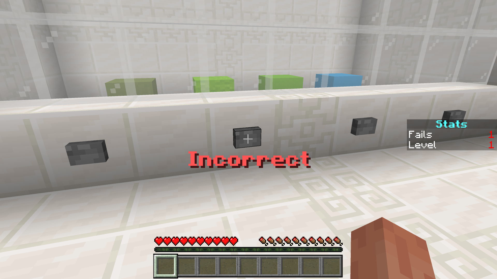
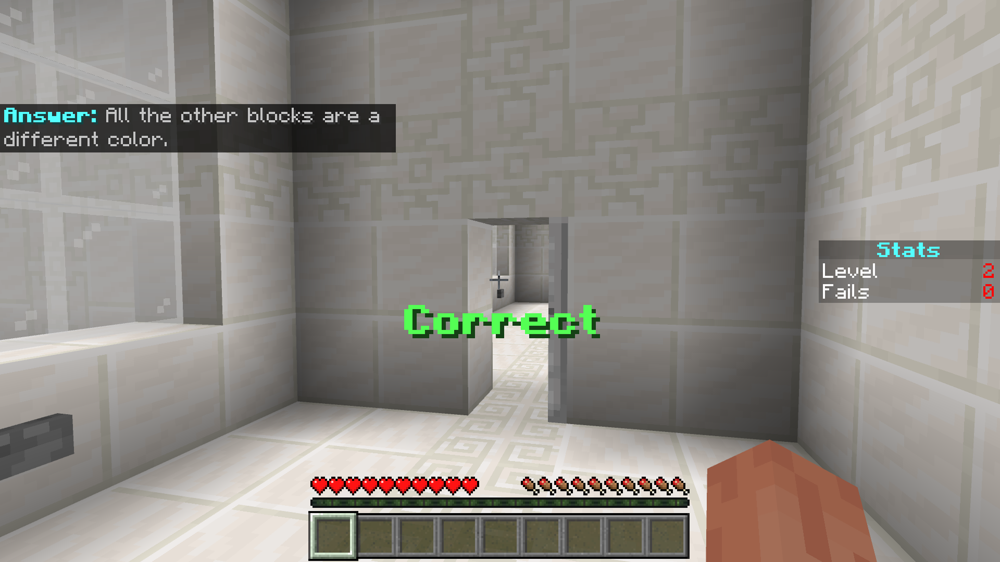
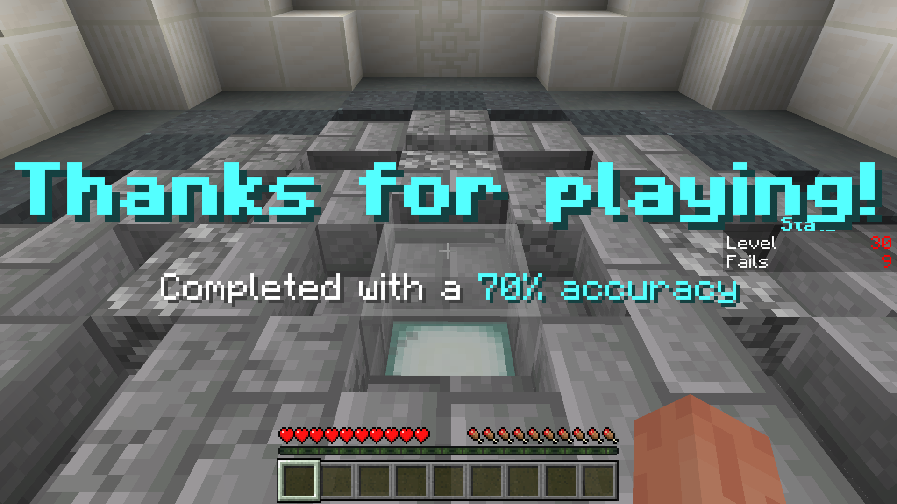
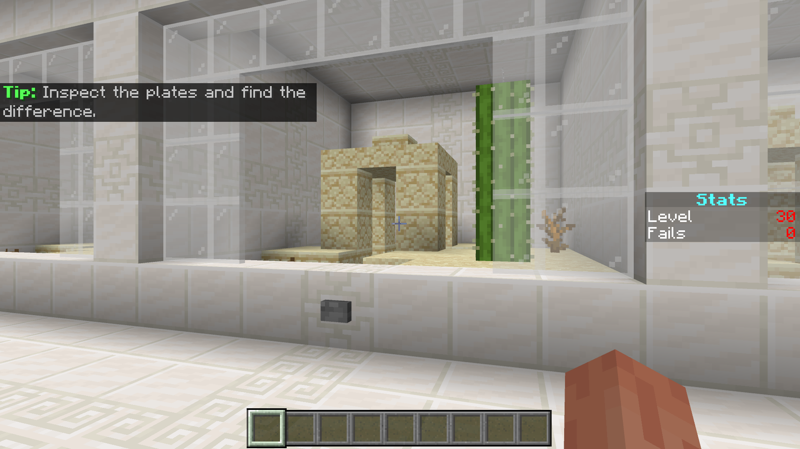

# TheOddOneOut

> Created by [Th3Emilis](https://github.com/th3emilis)

Inspired by a few maps played by CaptainSparklez, TheOddOneOut is a minigame where your goal is to try and guess the block, item, or entity that doesn’t belong based on properties such as colour, shape, or crafting recipe. There are 30 levels in total, but the number of fails you can get is unlimited. Can you make it to the end with as few fails as possible?

## How to Play

Press the button in front of the block, item, or entity that you think does not fit with the others. If your answer is wrong, you will get a fail.

If your answer is right, the door to the next level will open. You will also get a message explaining why that is the correct answer.

You have to try your best and get as few fails as you can by the end of the game. The fewer fails you get, the better your accuracy will be.

If 30 levels aren’t enough for you, there is also a bonus level to play where you’ll need to use the detective skills you picked up from mobile ad games to spot the difference among three similar plates.

## Terms of Use

By downloading, installing, accessing, using or interacting in any way with this map, you agree to be bound by the following terms:
- **Attribution** — You must give proper credit to the creator if you reference, use or feature any of the map contents (playthrough, files, etc.) in your own content, such as videos, blogs, or social media posts.
- **No Redistribution** — You may not reproduce, redistribute or republish the map in any form or by any means. You may not share the direct download link or any user-generated link to the map. Use one of the [official links](https://github.com/th3emilis/theoddoneout/blob/main/OFFICIAL_LINKS.md).
- **Non-Commercial** — You may not use the map for any commercial or revenue-generating purposes, such as advertising, selling or renting. You may not charge any fees or request any donations for accessing or using the map.
- **No Derivates** — You can remix, adapt or build upon the map for your own private use, but you may not share, distribute, or make available the modified version of the map to any third party.

## Feedback

For any suggestions, bugs or help, feel free to [join the Discord community](https://discord.gg/skqthyTkBQ).
